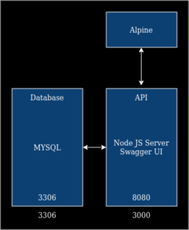
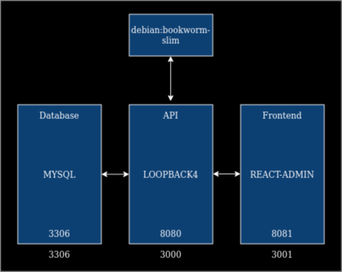
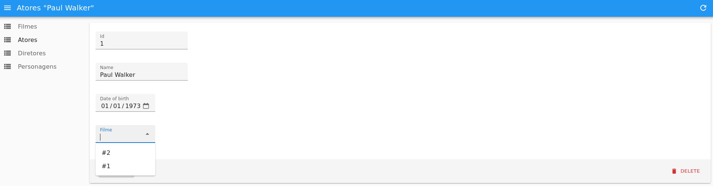

# C3 : Product

## 3.1 Development

_Describe the product development. Don't forget to add a system architeture diagram image. Expand as it seems fit._



Swagger

<br>



Loopback

## 3.2 Instalation
```
git clone https://github.com/inf23dw1g01/RepDW1.git

cd RepDW1

docker compose up --build
```  


## 3.3 Usage

- http://localhost:8080 Will bring you to the Swagger UI

- http://localhost:8081 Will bring you to the React App



In any of the lists you can click any of the items and change the values of its fields, a title will indicate where you are editing (Example: Atores "Paul Walker").


## 3.4 Implementation details

_Show here **how** you have fullfilled the miminum required objectives and **which** valorization elements you added to your work._


---
[< Previous](c2.md) | [^ Main](../../../) | [Next >](c4.md)
:--- | :---: | ---: 
